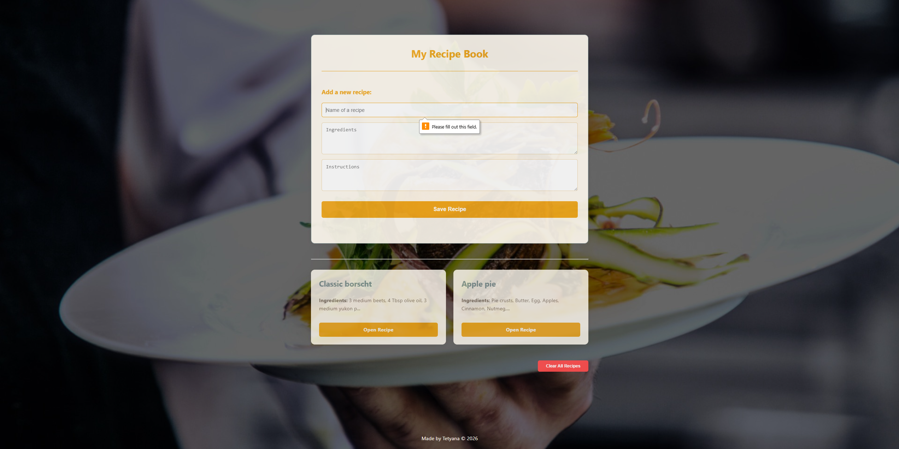
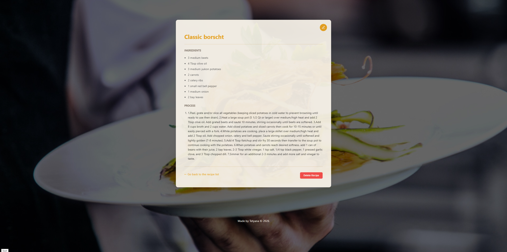
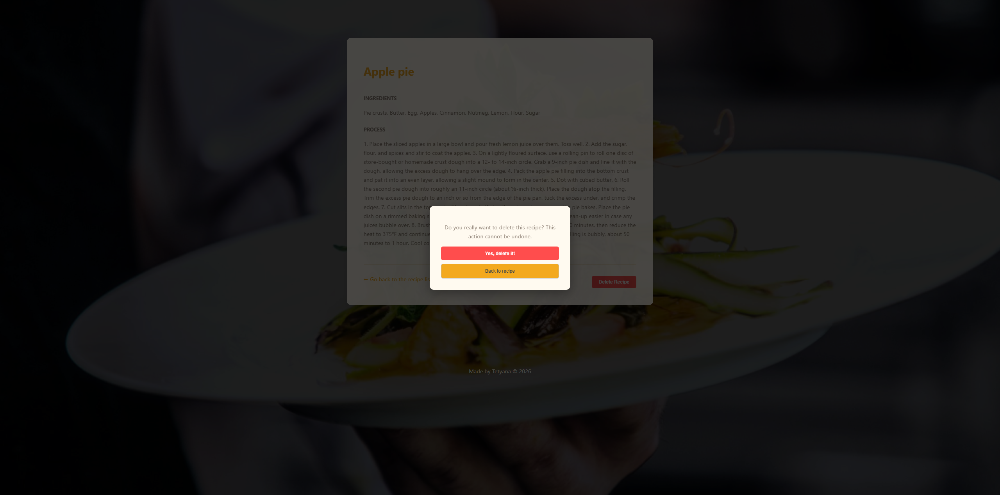
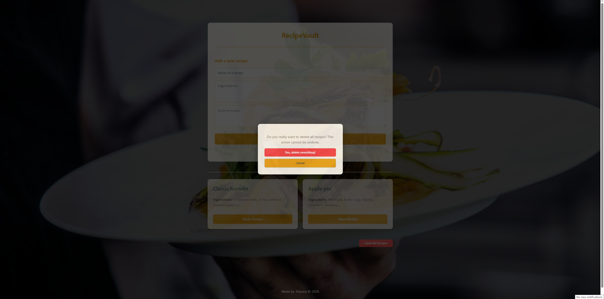
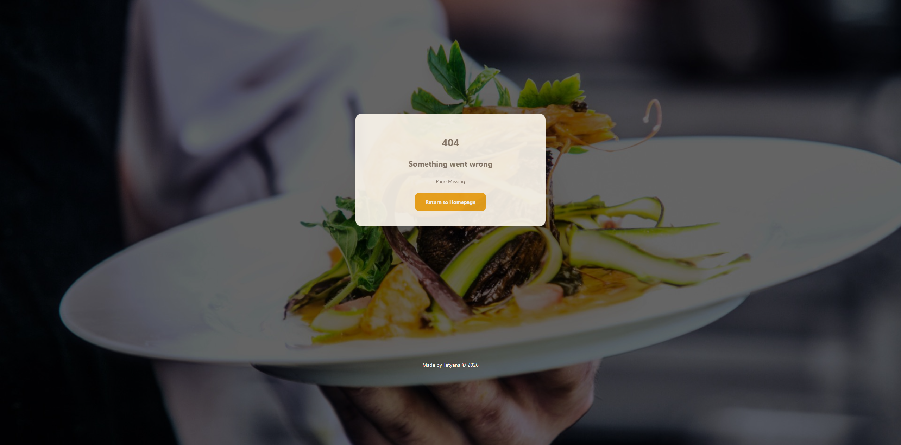
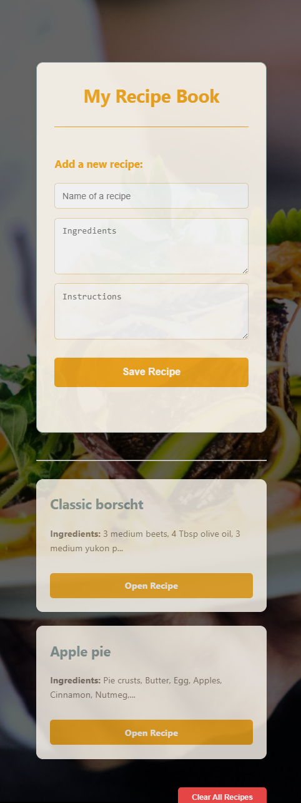

## RecipeVault

RecipeVault is a full-stack digital culinary archive designed to help users document, organize, and preserve their favorite recipes. Built with Node.js and Express, the application focuses on a clean, user-friendly interface that mimics a warm, physical cookbook.

---

## Screenshots

- Homepage With Recipes
  

<details>
  <summary>Click to view more screenshots (Desktop, Mobile, Details, 404)</summary>


- Recipe Details & Interactions

#### Individual Recipe Page

[Edit](screenshots/edit.png)



- Delete Confirmation Modal
  

- Delete All Modal
  

- Error Handling


- Mobile View
  
</details>

---

## 🚀 Features

- **Add Recipes** – Save a recipe with its name, ingredients, and step-by-step instructions
- **Edit Recipes** – Update any saved recipe through a dedicated edit form, accessed via a pencil icon
- **Formatted Ingredient & Instruction Lists** – Automatically parsed into clean, readable bullet points and numbered steps
- **Delete with Confirmation** – Individual recipe deletion and a "Clear All" option, both protected by a confirmation modal
- **Automatic Backups** – The server creates a backup of your recipe data on startup
- **Custom Error Pages** – Friendly 404 and 500 pages that match the app's design
---

## 🛠️ Tech Stack

- **Backend**: Node.js, Express.js
- **Templating**: EJS (Embedded JavaScript)
- **Frontend**: Vanilla JavaScript, CSS3
- **Data**: JSON-based recipe storage with automatic backups

---

## 📂 Project Structure

```text
recipe-book/
├── public/
│   ├── js/
│   │   └── ui.js
│   ├── styles.css
│   └── background.jpg
├── views/
│   ├── error/
│   │   └── 404.ejs
│   ├── partials/
│   │   ├── header.ejs
│   │   └── footer.ejs
│   ├── index.ejs
│   ├── recipe.ejs
│   └── edit-recipe.ejs
├── app.js
├── recipes.json
└── package.json
```
---

## ⚙️ Installation & Setup

1. Clone the repository

Run `npm install` in your terminal.

Start the application with node app.js.

Open your browser to http://localhost:3033.

---

Developed by Tetyana | Web Development Capstone 2026
